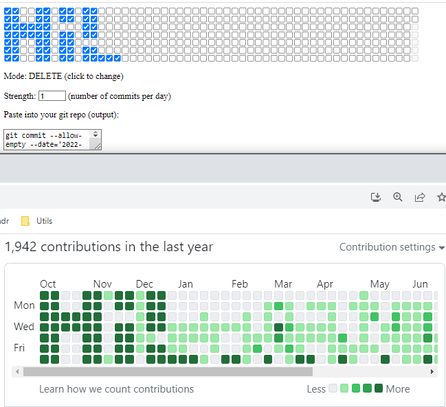

Available here: <https://dkorosec.github.io/git-paint>

Preview:

## How to use:

1. Draw your preview
2. Select "strength" of your perfect drawing
3. Copy the output and paste it into a git repository to create commits
4. git push
5. ???
6. Profit
